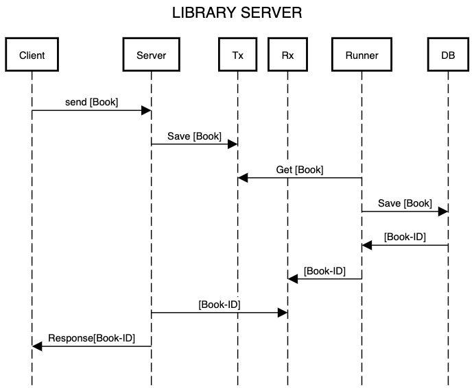

# Library Server v1

- Escrever um api que recebe livros e adiciona em uma biblioteca
- Usar queues/channels para receber os livros
- Usar tokio + hyper

A ideia aqui é escrever um CRUD básico no padrão REST API.

1. A aplicação inicia
2. então 4 runners são criados, 1 para cada thread
3. então o servidor é iniciado e espera por requests
4. quando um request chega no server
5. o request é mandado para o handler
6. o handler analiza o tipo de request que pode ser
   1. GET /wasms - precisa retornar todos os livros
   2. POST /wasm - precisa adicionar um novo livro
   3. PUT /wasm/{id} - precisa atualizar algum dado de um livro existente
   4. DELETE /wasm/{id} - precisa apagar um livro existente
7. então o handler envia a request para a function responsavel
8. se a request for um GET /wasms é retornado um Vec<wasms> ordenado pelo year dos wasms
   1. um wasm é um dado que contem 2 informações 1. title: String 2. year: u16
   2. o Vec<wasm> é obtido pela leitura do Libray que é um HashMap de wasms
9. se a request não for o GET então
10. a function resposavel deserializa de json para o struct RequestWasm
    1. RequestWasm é um struct que contem 3 informações
        - title: String 
        - year: u16
        - req_type: RequestType
    2. RequestType é um enum do tipo
        - SAVE: para um wasm novo
        - MODIFIER: para atualizar um wasm existente
        - DELETE: para remover um wasm
11. então a function coloca o RequestWasm no channel tx
12. O runner olha o channel rx
    1. e pega o wasm
    2. executa a ação de acordo com o req_type do RequestWasm

# ~~Library~~ Wasm Server v2

- Agora ao inves de `wasm` o server deve salvar um `.wasm` como um struct `Wasm`
- Os arquivos devem ser salvos em disco (DB)
- O DB deve ser embarcado com a aplicação
- O server deve poder executar o código desse arquivo `.wasm` salvo.

